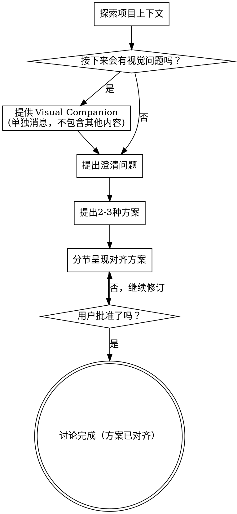

# 讨论并对齐方案

通过自然、协作式对话，把想法打磨为双方一致认可的方案。

先理解当前项目上下文，再每次只提一个问题来细化想法。当你明确了要构建什么后，呈现设计并获得用户批准。

<HARD-GATE>
在你呈现设计并获得用户批准之前，不得调用任何实现类技能、不得编写任何代码、不得搭建任何项目脚手架、也不得执行任何实现动作。无论项目看起来多简单，此规则都适用。
</HARD-GATE>

## 检查清单

你必须为以下每一项创建任务，并按顺序完成：

1. **探索项目上下文** —— 检查文件、文档、最近提交
2. **提供 Visual Companion**（若后续会涉及视觉问题）—— 该邀请必须是单独一条消息，不能与澄清问题合并
3. **提出澄清问题** —— 一次一个，明确目的/约束/成功标准
4. **提出 2-3 种方案** —— 给出权衡与推荐方案
5. **分节呈现对齐方案** —— 每节后确认用户是否认可，必要时回退修订

## 流程图

**流程终态是方案对齐完成。** 本技能只负责讨论和对齐，不包含文档落盘、提交代码、实现计划或编码执行。

**最终确认后的输出规则：** 当用户确认最终方案后，你只输出"最终方案"内容本身，不执行任何实现动作，不调用实现类技能，不编写代码。

## 具体流程

**理解想法：**

- 先查看当前项目状态（文件、文档、最近提交）
- 在问细节前先判断范围：如果请求描述了多个独立子系统（例如"构建一个含聊天、文件存储、计费和分析的平台"），应立即指出。不要先花大量问题去细化一个本应先拆分的项目。
- 如果项目规模过大，先帮助用户拆分为子问题：哪些部分彼此独立、如何关联、优先顺序是什么。然后先对齐第一个子问题。
- 对范围合适的项目，每次只问一个问题来细化想法
- 尽量使用多选题，必要时可用开放式问题
- 每条消息只包含一个问题；若某主题需深入，拆成多条消息
- 聚焦理解：目的、约束、成功标准

**探索方案：**

- 提供 2-3 种不同方案并说明权衡
- 以对话方式呈现选项，并给出你的推荐与理由
- 先给出你推荐的方案并解释原因

**呈现设计：**

- 当你认为已理解要讨论的内容时，开始呈现方案
- 每个章节按复杂度控制篇幅：简单项几句话即可，复杂项可达 200-300 字
- 每个章节后都询问用户"目前是否正确"
- 覆盖：架构、组件、数据流、错误处理、测试
- 若有内容不清楚，随时回退并继续澄清

**为隔离性与清晰性而设计：**

- 将系统拆成更小单元；每个单元只有一个清晰职责，通过定义明确的接口通信，并能被独立理解与测试
- 对每个单元，你都应能回答：它做什么、如何使用、依赖什么
- 不读内部实现能否理解其职责？替换内部实现能否不影响调用方？若不能，说明边界需要改进
- 小而边界清晰的单元也更利于你工作：你更容易在上下文窗口内完整推理，且聚焦文件更易稳定编辑。文件过大通常是职责过多的信号

**在现有代码库中工作：**

- 提方案前先了解现有结构，并遵循既有模式
- 如果现有代码问题会影响当前工作（例如文件过大、边界不清、职责耦合），把有针对性的改进纳入设计，这正是优秀开发者在真实代码中会做的事
- 不要提出与当前目标无关的重构，保持聚焦

## 对齐完成标准

- 用户可以一句话复述：目标是什么、为什么做、如何做
- 关键约束已明确：范围、边界、取舍
- 推荐方案与备选方案差异清楚，且用户明确确认
- 未解决问题被显式列出，并标注决策责任人与时点

## 最终输出格式

- **触发条件：** 仅在用户明确完成方案确认后输出。
- **输出边界：** 仅输出最终方案，不包含实现步骤、执行动作或落地结果。

## Visual Companion（视觉辅助伙伴）

Visual Companion 是用于展示 mockup、图示和视觉方案对比的浏览器辅助工具。它是工具，不是模式。用户同意启用后，仅代表在适合可视化的问题上可使用它，不代表所有问题都必须可视化。

**启用方式：** 当你预计后续会讨论视觉内容（如布局、线框图、流程图、界面比较）时，先单独发送以下邀请：

> "我们接下来的一些内容，可能通过网页可视化展示会更容易理解。我可以在过程中提供 mockup、图示、对比图等视觉材料。这个功能还比较新，而且可能消耗较多 token。要试试吗？（需要打开本地URL）"

**该邀请必须单独成条消息。** 不能和澄清问题、总结或其他内容混发。必须等待用户回复；如果用户拒绝，则继续纯文本流程。

**逐题判断是否使用：**

- 视觉内容（mockup、线框图、布局对比、架构图）优先用 Visual Companion
- 文本内容（需求澄清、概念选择、取舍讨论、范围决策）优先用普通对话

## 关键原则

- **一次一个问题** - 不要一次抛出多个问题
- **优先多选题** - 相比开放题更易回答
- **严格践行 YAGNI** - 从所有设计中移除非必要内容
- **探索备选方案** - 始终先给出 2-3 种方案再收敛
- **增量式验证** - 呈现设计并获批后再推进
- **保持灵活** - 发现不通顺时回退澄清
